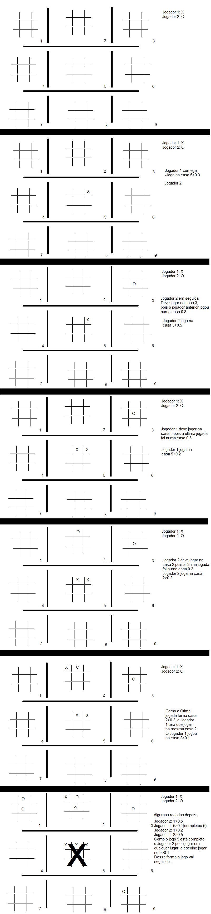

<h1> # MEGA JOGO DA VELHA </h1>
Esse projeto consiste num jogo da velha diferente do habitual. Cada espaço do jogo da velha é composto por jogos da velha menores.
 
<h2> Descrição do Jogo </h2>

 O jogo é semelhante ao jogo da velha habitual. Para jogar são necessários 2 jogadores, cada um com um símbolo (O e X). 

 Nessa versão modificada, o jogo se torna mais duradouro e estratégico que o habitual. Inicialmente parece comum, pois o jogo começa com um tabuleiro de jogo da velha, com 9 casas: 

 1 | 2 | 3 

 4 | 5 | 6 

 7 | 8 | 9 

 O jogador que conseguir completar primeiro uma linha, coluna ou diagonal composta por 3 dos seus símbolos vence o jogo, nada de novo até aqui.

 O diferencial dessa versão é que em cada casa (1 a 9), ao invés de simplesmente escolher uma delas e colocar seu símbolo, haverá uma disputa para colocar o símbolo lá, onde cada casa desse jogo da velha é na verdade um jogo da velha também. Para que aquele espaço receba o símbolo do Jogador, ele deve vencer o "mini" jogo da velha correspondente, transformando a casa no símbolo dele, que será o importante para vencer o "mega" jogo da velha. 

 Para facilitar o entendimento da regra, considere o seguinte: Quando estiver tratando dos "mini" jogos da velha que ocorrem dentro de cada espaço do "mega" jogo da velha, serão utilizados números decimais. E quando estiver tratando do "mega", serão utilizados números inteiros. Segue um exemplo, onde temos o "mega" jogo a esquerda e o "mini 5", sendo um 'zoom' da casa 5 do "mega" jogo.

MEGA  &nbsp;  &nbsp;  &nbsp; &nbsp; &nbsp; &nbsp; MINI 5

 1 | 2 | 3 &nbsp; &nbsp; &nbsp; &nbsp;  0.1 | 0.2 | 0.3 

 4 | 5 | 6 &nbsp; &nbsp; &nbsp; &nbsp;  0.4 | 0.5 | 0.6 
 

 7 | 8 | 9 &nbsp; &nbsp; &nbsp; &nbsp;  0.7 | 0.8 | 0.9
 

 O jogo também não é simplesmente jogar um "mini" jogo da velha atrás do outro e ir marcando o símbolo no "mega", pois na verdade todos os "mini" jogos estão ocorrendo simultâneamente 

 
<h2> Exemplo </h2>

 Jogador 1 => X 

 Jogador 2 => O 

 O Jogador 1(X) começa em qualquer lugar que desejar, nesse exemplo, ele escolheu jogar na casa 5. 

 Dentro dessa casa 5, há 9 opções para se escolher (0.1 a 0.9) 

 Com isso, o Jogador 1 escolhe uma das casas do "mini" e marca o X lá. O Jogador 2 irá jogar em seguida, na casa "maior" correspondente a mini jogada.

 O jogador 1 então, começa o jogo e está jogando na casa 5, indo para o "mini 5", e escolhe jogar seu X na casa 0.3. O jogador 2 irá então para uma nova casa, que está ligada ao espaço 0.3 de todas os "mini" jogos, que é a "mega" casa 3. Lá ele escolhe jogar na casa 0.5, o que faz com que o Jogador 1 tenha que na sua vez jogar novamente na casa 5 do jogo "mega". 

 O jogo maior inicialmente não tem grandes mudanças, apenas quando cada "mini" jogo for sendo finalizado é que a casa "mega" se torna o símbolo que venceu no "mini" jogo. 

 Por exemplo, supondo que após diversas rodadas, os "mini" jogos da casa 3 e 5 estejam assim: 

MINI 3 &nbsp;  &nbsp;  &nbsp; &nbsp; &nbsp; &nbsp; MINI 5

  X | &nbsp;&nbsp;&nbsp; | &nbsp; &nbsp; &nbsp;&nbsp; &nbsp; &nbsp; &nbsp; &nbsp; &nbsp; &nbsp; &nbsp;| X | O 

  O | X | &nbsp; &nbsp; &nbsp; &nbsp; &nbsp; &nbsp; &nbsp; &nbsp; &nbsp;&nbsp;&nbsp; | O | X 
 
  O | O | X  &nbsp;&nbsp;&nbsp; &nbsp; &nbsp; &nbsp; &nbsp; O | &nbsp;&nbsp;&nbsp; |

 O Jogador 1(X) venceu o "Mini 3" e o Jogador 2(O) venceu o "Mini 5". Com isso, o jogo "Mega" estaria da seguinte forma: 

 1 | 2 | X 

 4 | O | 6 

 7 | 8 | 9 

 Se ao longo do jogo o Jogador 1 conseguisse ganhar os "mini 6 e 9", completaria a coluna da direita e ganharia o jogo. 

 Um detalhe importante é que, como as casas 3 e 5 estão completas e não é mais possível jogar nos "mini" delas, caso algum jogador jogue numa casa 0.3 ou 0.5 de qualquer outro "mini" jogo, o jogador seguinte poderá escolher jogar em qualquer uma das casas disponíveis, uma vez que seria direcionado para uma casa que já foi finalizada. 

 Caso estejam jogando por exemplo na casa 4, e o Jogador 1 jogue na casa 0.4, o Jogador 2 jogará a próxima rodada em alguma casa desse mesmo "mini 4". 
  
<h2>Exemplo com imagens </h2>

 Segue um exemplo prático do jogo passo a passo 

