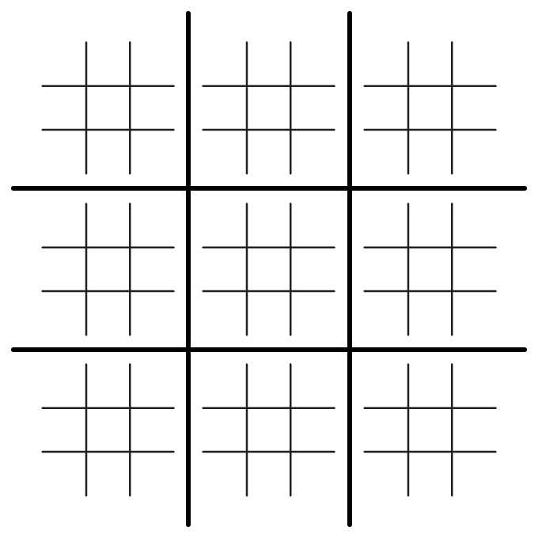
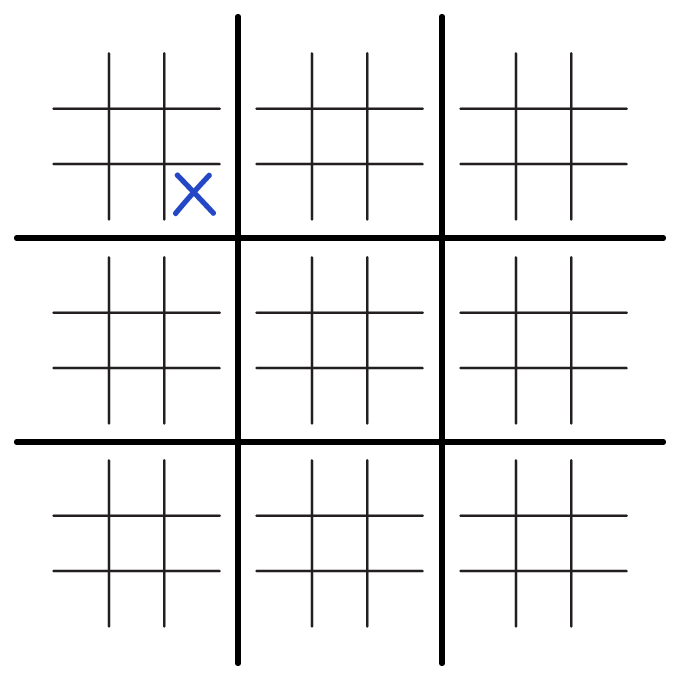
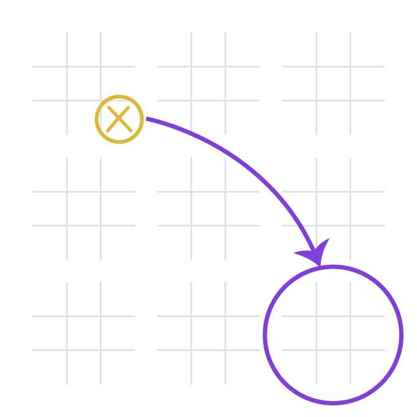
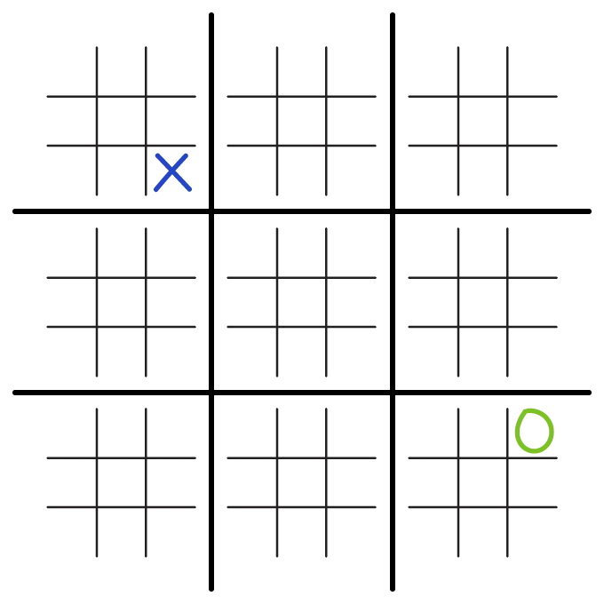
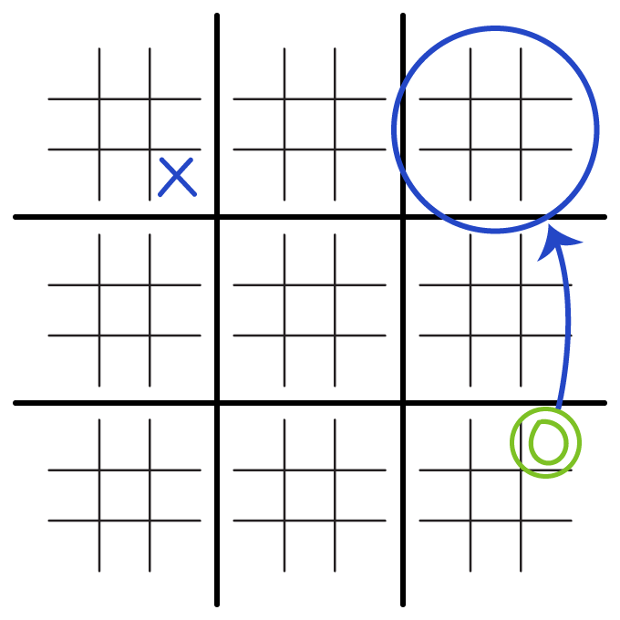
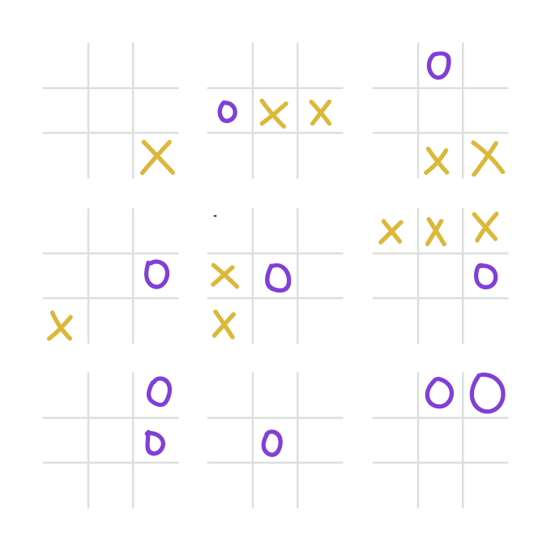
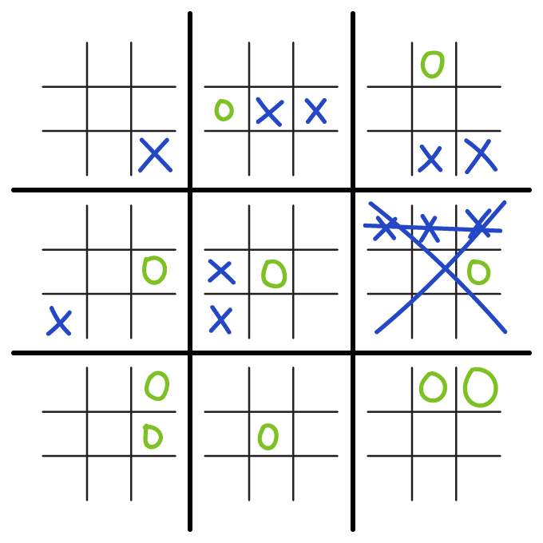
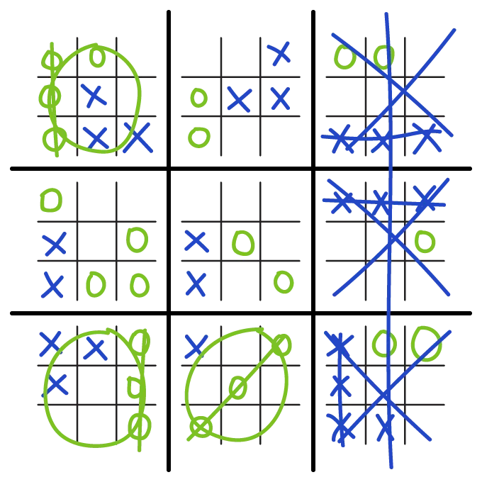

<h1> # SUPER JOGO DA VELHA </h1>
Esse projeto consiste num site que contém um jogo da velha para ser jogado por 2 jogadores, mas que é um pouco diferente do jogo da velha comum. Resumidamente: é um jogo da velha grande que é composto por jogos da velha menores ocorrendo simultâneamente. 
 
<h2> Descrição do Jogo </h2>

 O jogo é semelhante ao jogo da velha habitual. Para jogar são necessários 2 jogadores, cada um com um símbolo (O e X). 

 Nessa versão modificada, o jogo se torna mais duradouro e estratégico que o habitual. Inicialmente parece comum, pois o jogo começa com um tabuleiro de jogo da velha, com 9 casas: 

 O jogador que conseguir completar primeiro uma linha, coluna ou diagonal composta por 3 dos seus símbolos vence o jogo, nada de novo até aqui.

 O diferencial dessa versão é que em cada casa (1 a 9), ao invés de simplesmente escolher uma delas e colocar seu símbolo, haverá uma disputa para colocar o símbolo lá, onde cada casa desse jogo da velha é na verdade um jogo da velha também. 

 Para que aquele espaço receba o símbolo do Jogador, ele deve vencer o "mini" jogo da velha correspondente, transformando a casa no símbolo dele, que será o importante para vencer o "mega" jogo da velha. 

 Para ganhar o jogo, você deve preencher 3 dos espaços grandes, formando uma linha/coluna/diagonal, e para preencher os espaços grandes, deve-se ganhar o jogo da velha dentro daquela espaço. 
  
<h2>Andamento do Jogo</h2>

 O jogo não é simplesmente jogar um mini jogo da velha atrás do outro e ir marcando o símbolo nos espaços grandes, pois na verdade todos os jogos menores ocorrem simultaneamente. 
  

 Funciona da seguinte forma: 

 Nesse exemplo, o 'X' irá começar. Ele marca no local desejado.

 Em seguida, o 'O' joga, mas não poderá jogar em qualquer lugar. O local que o último jogador jogou é que define onde o seguinte irá jogar. O espaço jogado no jogo menor corresponde ao espaço maior que o próximo jogador deve jogar, colocando sua peça onde desejar naquela área. 

 Com isso, o 'O' marca onde quiser naquela região, que definirá também onde o 'X' terá que jogar na próxima rodada 

 Considerando esse local que o 'O' jogou, o 'X' então deverá jogar em alguma casa do jogo da velha que está no seguinte espaço: 

 Pulando algumas rodadas para ilustrar o funcionamento dele, chegamos na seguinte situação: 

 Nesse caso, o 'X' já ganhou na coluna da direita/linha do meio. E aquele espaço grande torna-se finalmente um 'X' 

 Se avançarmos mais ainda no jogo, poderíamos ter a seguinte situação, com o 'X' saindo como vencedor: 

 Um detalhe importante é que, caso algum jogador jogue num espaço que forçaria o próximo jogador a ir para um espaço que já foi finalizado, ele poderá jogar em qualquer espaço que quiser. 

 Se um jogo menor terminar em empate, aquele espaço fica "em branco", e não poderá mais ser usado para vencer o jogo, e da mesma forma, se alguém for levado a jogar nele, poderá escolher jogar em qualquer outro espaço. 

